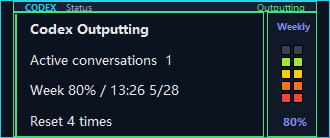
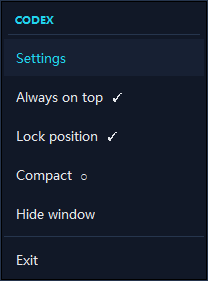
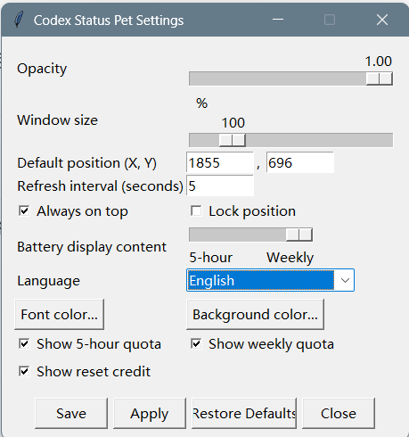

# Codex Windows Status Pet

简体中文: [中文版本](README.zh-CN.md)

An unofficial Windows companion for Codex. It provides a small desktop overlay and a notification-area icon for live Codex activity, rate limits, and reset credits.

Supported platform: Windows 11 x64. Windows 10 is Deferred, Not claimed, and Non-blocking; ARM64 and 32-bit Windows are not claimed.

## Features

- Reads rate limits from the local `codex app-server --stdio` JSON-RPC interface.
- Detects active Codex sessions from local session JSONL files.
- Renders activity, active-conversation count, 5h quota, weekly quota, and Reset Credit as five independent stable rows without exposing plan-step details.
- Supports multiple monitors and preserves user-supplied virtual-desktop coordinates.
- Keeps the context menu fully inside the active monitor work area, including bottom-right edges.
- Settings: English/Simplified Chinese language selection, opacity, one proportional Window Size slider (80–200%), font color, background color, default X/Y position, always-on-top, position lock, independent 5h/weekly/reset-credit row visibility, battery quota source, and a digit-only 1–10 second refresh interval.
- The battery source can be 5h or weekly; weekly is the default and an unavailable selected source never falls back to the other quota window.
- Weekly quota and the earliest future reset-credit expiry use local `HH:MM M/D` formatting without leading zeroes.
- Settings actions: Save, Apply, Restore Defaults, and Close.
- Context menu: localized Settings, topmost, lock, and persisted manual Compact controls. Notification-area menu: show, hide, open settings, and exit.
- The packaged product runs as `CodexStatusPet.exe`; no persistent command prompt window is required.
- The source launcher starts the companion on demand for development only; it does not install an automatic sign-in entry.

## Packaged release quick start

For normal use, download the official Release ZIP, verify its published
SHA-256 when manually validating the artifact, extract the **complete** archive,
open the extracted `CodexStatusPet` directory, and run `CodexStatusPet.exe`.
`CodexStatusPet.exe` is the application entry point, not an installer.

Do not copy only `CodexStatusPet.exe` out of the extracted onedir package. Its
`_internal` runtime and release manifest must remain beside it. This ZIP-direct
path does not create a Start Menu shortcut or installed-product state.

The repository is private. The v0.8.0 release can be obtained only by a Tom or
authorized collaborator using an authenticated GitHub path; anonymous public
download commands are intentionally not documented. The v0.9.0 Program will add
a verified authenticated PowerShell deployment command for installed use.

## Notification-area tray icon

The real CodexStatusPet tray icon is a **dark navy square with a light-blue
circular face and two small dark square eyes**. Find it in the Windows
notification area near the clock. If it is not visible, select the `^` hidden
icons button first. Right-click this icon to open the CodexStatusPet tray menu,
then choose **Settings**. This icon is distinct from the Codex app icon and
from Windows system icons because it has the light-blue face on the navy tile.


## Packaged v0.8.0 screenshots

All screenshots below were captured manually from the real packaged
`CodexStatusPet.exe` on Windows 11 after normalization to the expanded layout,
100% Window Size, and 100% opacity.

### English







## Data and security boundary

The companion starts only the local Codex app-server and reads local Codex session metadata. Its quota provider normalizes already-fetched local data only; it does not read `auth.json`, access tokens, or project files, send data to a third-party service, or maintain its own backend. The only network activity comes from the official local Codex app-server process.

Local settings are stored at `%USERPROFILE%\.codex\codex-windows-status-pet.json`.

See [ROADMAP](docs/product/ROADMAP.md) for the phased roadmap and [API_SPEC](docs/architecture/API_SPEC.md) for test boundaries.
See [COMPATIBILITY_MATRIX](docs/quality/COMPATIBILITY_MATRIX.md) for current Windows evidence and release gates.
See [development documentation](docs/README.md) for the document map and migration status.

## Development

`start_codex_status_pet.cmd` is a source-development, debugging, source
verification, and release-engineering launcher. It is not the normal product
entry point. The bundled Python runtime is preferred; if it is unavailable, the
launcher falls back to `pythonw.exe` on `PATH`, whose environment must install
the packages listed in `requirements.txt`.

### Development checks

```powershell
python -m py_compile .\scripts\codex_status_pet.py
$py = "$env:USERPROFILE\.cache\codex-runtimes\codex-primary-runtime\dependencies\python\python.exe"
& $py -m unittest discover -s .\tests -v
```

Routine automated Quality is `python scripts/run_quality_checks.py`; passing it is not release approval. A formal candidate and Windows CI use the single command `python scripts/run_release_candidate_checks.py`, which runs Quality, package smoke, strict compatibility, and whitespace once and separates passes, blockers, and limitations.
The verification authority and automation/physical classification for each release fact are recorded in `docs/quality/verification-inventory.json`.
Use `python scripts/check_release_readiness.py` to inspect current compatibility blockers and explicitly deferred physical limitations. The repository does not install a Startup-folder entry automatically.
Use `python scripts/startup_audit.py` to report known legacy startup entries; it is read-only unless a maintainer explicitly removes a confirmed old entry.

Before publishing, approve the intended GitHub owner in the local repository. The tracked `.githooks/pre-push` guard rejects pushes until this is set and rejects any remote whose owner differs from it:

```powershell
git config --local core.hooksPath .githooks
git config --local codex.expected-owner <your-github-username>
git config --local user.name "Your GitHub display name"
git config --local user.email "your-github-noreply-email"
git config --local codex.expected-author-email "your-github-noreply-email"
```

The hook validates both the remote owner and the commit author email. This is deliberate: the GitHub CLI account, credential helper, and global Git identity are machine-level state and must not silently determine where a project is published or whose name appears on commits.

The application is intentionally an external companion. Codex custom pets currently provide a static spritesheet contract, so dynamic text remains in this companion overlay rather than being injected into the built-in pet.

## License

MIT. See `LICENSE` if one is added by the project owner.
