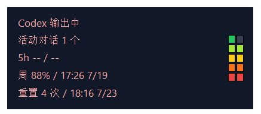
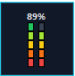
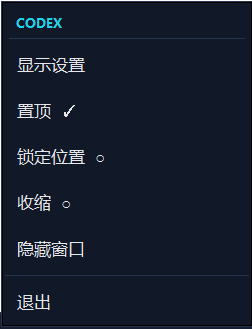
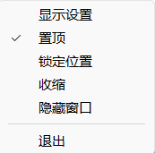
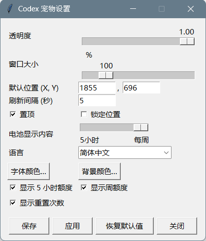

# Codex Windows 状态宠物

English: [English version](README.md)

## 当前 v0.9.2-beta.1 UI 截图

以下截图展示当前 beta 版 Signal HUD 主悬浮窗、紧凑电池、深色/浅色右键菜单和设置界面，均来自 Windows 11。

### 简体中文











## 通知区域托盘图标

真实的 CodexStatusPet 托盘图标是**深海军蓝色方形底图上的浅蓝色圆脸，带两只小的深色方形眼睛**。它位于 Windows 右下角时钟附近的通知区域；若未显示，请先点击 `^` 展开隐藏图标。右键该图标即可打开 CodexStatusPet 托盘菜单，并选择“设置”。它与 Codex 应用图标及 Windows 系统图标不同：其特征是深蓝底上的浅蓝圆脸。

这是一个非官方 Windows Codex 外部伴侣工具，提供小型桌面悬浮窗和通知区域图标，用于显示 Codex 活动、额度和重置次数。

受支持平台：Windows 11 x64。Windows 10 为延期、不声明支持、非阻塞；ARM64 和 32 位 Windows 不在声明范围内。

## 功能

- 通过本机 `codex app-server --stdio` JSON-RPC 接口读取额度。
- 从本机会话 JSONL 文件判断活动中的 Codex 会话。
- 将活动状态、活动会话数、5h 额度、周额度和 Reset Credit 渲染为五个独立稳定行，不暴露计划步骤详情。
- 支持多个显示器，并保留用户填写的虚拟桌面坐标。
- 右键菜单始终完整位于活动显示器工作区内，包括右下角边界。
- 设置包括英文/简体中文语言选择、透明度、一个 80–200% 的按比例“窗口大小”滑块、字体颜色、背景颜色、默认 X/Y 坐标、置顶、锁定位置，以及只能输入数字的 1–10 秒刷新间隔。
- 设置包括 5 小时、每周和重置次数三项独立的行可见性，以及电池配额来源选择。
- 电池可选择 5 小时或每周来源；每周为默认值，选中来源不可用时不会回退到另一配额窗口。
- 周额度和最近未来 Reset Credit 到期时间使用本地 `HH:MM M/D` 格式，月和日不补前导零。
- 设置操作包括保存、应用、恢复默认值和关闭。
- 右键菜单提供本地化的设置、置顶、锁定位置和可持久化手动 Compact 控制；通知区域菜单支持显示、隐藏、打开设置和退出。
- 打包产品以 `CodexStatusPet.exe` 运行，无需保留命令提示符窗口。
- 源码启动器仅供开发时按需启动伴侣，不会安装 Windows 登录自动启动项。

## 打包 Release 快速开始

正常使用时，请下载官方 Release ZIP；如需手动验证，请核对发布的
SHA-256；然后解压**完整**压缩包，打开解压后的 `CodexStatusPet` 目录，
并运行 `CodexStatusPet.exe`。`CodexStatusPet.exe` 是正式应用入口，不是安装器。

不要只从 onedir 包中复制 `CodexStatusPet.exe`。`_internal` 运行时和发布清单
必须与 EXE 保持同目录。ZIP 直接使用不会创建开始菜单快捷方式，也不会声明已安装状态。

## 快速安装和升级（公开仓库）

公开 bootstrap 使用 GitHub 匿名 REST Release 元数据和精确发布资产。
普通安装不需要 Git、GitHub CLI、`gh auth login`、账号、token、Python、pip 或仓库检出。
运行以下 PowerShell 命令即可安装或修复最新稳定 Release：

```powershell
powershell.exe -NoProfile -ExecutionPolicy Bypass -Command "& ([scriptblock]::Create((Invoke-RestMethod 'https://github.com/TomTang701/codex-windows-status-pet/releases/latest/download/CodexStatusPet-bootstrap.ps1')))"
```

再次运行相同命令可升级至较新的已发布 Release，或完成已验证的同版本修复。若要固定稳定版本，
在 bootstrap 调用后增加 `-Tag` 参数：

```powershell
powershell.exe -NoProfile -ExecutionPolicy Bypass -Command "& ([scriptblock]::Create((Invoke-RestMethod 'https://github.com/TomTang701/codex-windows-status-pet/releases/latest/download/CodexStatusPet-bootstrap.ps1'))) -Tag v1.1.0"
```

bootstrap 会校验精确 ZIP 和 SHA-256 sidecar，保留 CodexStatusPet 设置及无关 `.codex` 数据，
并将实际事务委托给现有 `install.ps1`。

GitHub 的 **Code -> Download ZIP** 和 Release 中的 `Source code (zip)` 都是源码压缩包，不是产品包。
请使用名称为 `CodexStatusPet-vX.Y.Z-win11-x64.zip` 的版本化产品 ZIP，或使用上面的公开 bootstrap。

如需安装下载的确切版本，请从正式 Release 下载
`CodexStatusPet-v1.1.0-win11-x64.zip`，完整解压 `CodexStatusPet` 目录，然后双击
`launch.cmd`。首次运行会安装并启动该解压版本，不会重复下载 ZIP；
以后运行则直接启动已配置副本。公开 bootstrap 仍是安装最新版、修复和升级时
推荐的自动 SHA-256 校验方式；手动 ZIP 用户可核对发布的 `.sha256` sidecar。

## 数据与安全边界

伴侣只启动本机 Codex app-server，并读取本地 Codex 会话元数据。额度数据源只规范化已经获取的本地数据；不读取 `auth.json`、访问令牌或项目文件，不向第三方服务发送数据，也不维护自建后端。唯一网络活动来自官方本机 Codex app-server 进程。

本地设置保存在 `%USERPROFILE%\.codex\codex-windows-status-pet.json`。

参见 [ROADMAP](docs/product/ROADMAP.zh-CN.md) 了解分阶段路线图，参见 [API_SPEC](docs/architecture/API_SPEC.zh-CN.md) 了解测试边界。
参见 [COMPATIBILITY_MATRIX](docs/quality/COMPATIBILITY_MATRIX.zh-CN.md) 了解当前 Windows 证据和发布门禁。
参见[开发文档首页](docs/README.zh-CN.md)了解文档地图和迁移状态。

## 开发

`start_codex_status_pet.cmd` 仅用于源码开发、调试、源码验证和发布工程，
不是普通用户的产品入口。启动器优先使用 Codex 捆绑的 Python 运行时；不可用时
回退到 `PATH` 中的 `pythonw.exe`，其环境必须安装 `requirements.txt` 中列出的包。

### 开发检查

```powershell
python -m py_compile .\scripts\codex_status_pet.py
$py = "$env:USERPROFILE\.cache\codex-runtimes\codex-primary-runtime\dependencies\python\python.exe"
& $py -m unittest discover -s .\tests -v
```

日常自动 Quality 命令是 `python scripts/run_quality_checks.py`；通过不代表发布批准。正式候选版本和 Windows CI 统一使用唯一命令 `python scripts/run_release_candidate_checks.py`，它只运行一次 Quality、打包冒烟、严格兼容性和空白检查，并分别输出通过项、阻塞项和限制。
每项发布事实的权威检查及自动化/实体分类记录在 `docs/quality/verification-inventory.json`。
使用 `python scripts/check_release_readiness.py` 检查当前兼容性阻塞项和明确延期的实体环境限制。仓库不会自动安装启动文件夹项目。
使用 `python scripts/startup_audit.py` 报告已知旧启动项；该命令只读，只有维护者明确批准后才可删除确认过的旧项目。

发布前，必须在本地仓库明确批准目标 GitHub 所有者。受跟踪的 `.githooks/pre-push` 会在未设置时拒绝推送，也会拒绝所有者不匹配的远程仓库：

```powershell
git config --local core.hooksPath .githooks
git config --local codex.expected-owner <你的-github-用户名>
git config --local user.name "你的 GitHub 显示名称"
git config --local user.email "你的 GitHub noreply 邮箱"
git config --local codex.expected-author-email "你的 GitHub noreply 邮箱"
```

钩子同时校验远程所有者和提交作者邮箱。这样 GitHub CLI 账号、凭据助手或全局 Git 身份不会静默决定发布位置或提交署名。

该应用刻意保持为外部伴侣。Codex 自定义宠物当前提供静态 spritesheet 契约，因此动态文字保留在外部悬浮窗中，不注入内置宠物。

## 许可证

MIT。如果项目所有者添加许可证文件，请以 `LICENSE` 为准。
